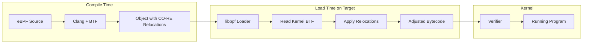
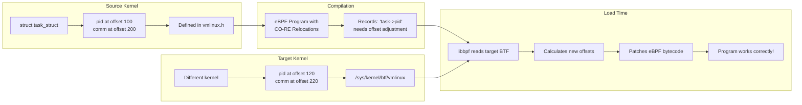

#  `libbpf` and `libbpf-rs`:

- C and Rust way to write eBPF programs
- Use Aya for projects that want to skip `libbpf` but still want CO-RE

---

# libbpf

References:
    1. [Linux kernel libbpf overview](https://docs.kernel.org/bpf/libbpf/libbpf_overview.html)
    2. [Howto use libbpf for CO-RE development](https://oneuptime.com/blog/post/2026-01-07-ebpf-libbpf-portable-development/view)

## Introduction:

Before we start with `libbpf-rs`, a look at `libpf`  and what's under the hood of `libbpf`:

- `libbpf` is Swiss Army Knife for eBPF development, as it sync with the kernel development and
implementation, While `eBPF` allows to run custom code inside Linux kernel, it can only understand raw
bytecode for eBPF VM. 

- `libbpf` is the standard C library that handles this dirty work of taking human readable code and
  getting it safely and effectively into the kernel. 

- what `libbpf` offers:
    - Program loading and verification - Load eBPF bytecode into the kernel.
    - Map management - Create and interact with eBPF maps.
    - Skeleton generation - Auto-generate C headers for easy program interaction.
    - CO-RE support - Enable portable eBPF programs across kernel versions.
    - BTF integration - Leverage type information for portability.

### Loader and Manager:

These eBPF programs to run in the kernel it has to go through a complex life-cycle which is divided into
3 steps which is handled by a loader/manager program:
- Opening: 
    - The Bytecode (ELF file) is generated by clang(-target bpf) or LLVM ( --target bpfel-unknown-none)
      is parsed, to find the programs and data structures( maps ) you define in the code. 
    - In modern CO-RE development using tools like `clang` and `libbpf` we generally use `-target bpf` flag
      to invoke the compiler. Which produces relocatable ELF object file containing the BPF bytecode. 

    Reference: [eBPF assembly with LLVM](https://qmonnet.github.io/whirl-offload/2020/04/12/llvm-ebpf-asm/)

- Loading:
    - The loader program interacts with `bpf()` system call to move the bytecode into the kernel and
      triggers the Verifier which ensures the loaded code won't crash the system 

- Attaching: 
    - It hooks your program to the right place: where that's a network interface (XDP) a kernel function
      (kprobe) or a `tracepoint`(tp)...
    - Linking is also done using `bpf()` system call with `BPF_LINK_CREATE` command to establish a
      connection between the loaded eBPF program and the specific kernel hook.

    NOTE: for older kernel `bpf()` call is used with `BPF_PROG_ATTACH`

    - For `kprobes` and `uprobes` the `perf_event_open()` syscall can be used to create a performance event
      file-descriptor which is then used to attach the `eBPF` program. 

    - `setsockopt()`: For socket filter programs, the programs file descriptor can be attached to a socket
      using `setsockopt()` with `SO_ATTACH_BPF` option.


- `bpf()`: this syscall is the central interface for most of the eBPF programs, including loading
  (BPF_PROG_LOAD) and managing its attachment using modern `BPF_LINK_CREATE` commands.

### CO-RE: (Compile Once - Run Everywhere)

This is the most famous feature of `libbpf`. Historically eBPF program were brittle; if you compiled a
program for one kernel version, it often wouldn't work on another because the data structures change.

- `libbpf` uses **BTF** ( BPF Type Format ) to `read` the target kernel at runtime. It then automatically
  adjusts ( relocates ) the program's memory offsets to match that specific kernel. This allows to ship a
  single binary that works across many distributions and version without needing to recompile on each
  machine.

- CO-RE technology that enables truly portable of eBPF programs. Below is the flow:




### How CO-RE Relocations Work:


On compilation a eBPF program with CO-RE:

- Compiler: The compiler (clang/LLVM) records field offsets from the development machine's kernel headers

- Loading: On loading `libbpf` reads the target kernel's **BTF** and adjusts field offsets to match.

- Result: The same compiled program works across different kernel version.

### Skeleton Generation:


Skeleton files act as a glue between the kernel eBPF code and the user-space loader code.

First the eBPF programs are compiled to BPF object files ( using clang )

Next we use `bpftool` to strip these compiled object files and wrap it into a C header file. 

These generated skeleton files are used by the loader program, its included in the user-space code as
header.

The generated skeleton header contains:
    - Embedded bytecode: The actual BPF instructions are stored as string within the header, so you dont
      have to strip a separate `.o` file with your binary.
    - Structure Definitions: It automatically creates C structures that match your BPF maps and global
      variables, allowing you to access them by name (e.g., skel->maps.my_map) instead of using lookups.

- `libbpf` works with a tool called `bpftool` to generate a "skeleton" (a C header file). 
- This makes it incredibly easy for your user-space application (the part you interact with) to talk to
  your kernel-space `eBPF` program. 
- It provides a clean, type-safe way to access variables and maps without manual memory mapping.

- Before compiling, you need to generate the `vmlinux.h` header from your kernel's BTF.
  `bpftool` command extracts all kernel type definitions into a single header file:

  `bpftool btf dump file /sys/kernel/btf/vmlinux format c > include/vmlinux.h`

Note:
---
Before skeletons existed, developers manually called `bpf_object__open()` and find map file descriptors by 
string names. It was error-prone and tedious. The skeleton makes the BPF program feel like a native
library, providing type safety and auto-loading capabilities.

---
###  Advance program tricks:

- CO-RE provides several macros for safely reading kernel structures with automatic relocation.
- The following examples demonstrate proper CO-RE usage patterns:

```c 
// src/advanced_core.bpf.c
// Advanced CO-RE examples demonstrating safe kernel structure access

#include "vmlinux.h"
#include <bpf/bpf_helpers.h>
#include <bpf/bpf_core_read.h>

// BPF_CORE_READ - Read a single field with CO-RE relocation
// Syntax: BPF_CORE_READ(source_ptr, field1, field2, ...)
// This follows pointer chains safely

SEC("kprobe/do_sys_openat2")
int trace_openat2(struct pt_regs *ctx)
{
    struct task_struct *task;
    struct mm_struct *mm;
    pid_t pid;
    unsigned long start_brk;

    // Get the current task
    task = (struct task_struct *)bpf_get_current_task();

    // Example 1: Read a simple field
    // BPF_CORE_READ handles kernel version differences automatically
    pid = BPF_CORE_READ(task, pid);

    // Example 2: Read through pointer chain
    // This reads task->mm->start_brk safely, handling NULL pointers
    // Equivalent to: task->mm->start_brk but CO-RE safe
    start_brk = BPF_CORE_READ(task, mm, start_brk);

    // Example 3: Using BPF_CORE_READ_INTO for reading into local variable
    // Useful when you need to read the same field multiple times
    BPF_CORE_READ_INTO(&mm, task, mm);
    if (mm) {
        // Now we can use mm safely
        unsigned long end_data = BPF_CORE_READ(mm, end_data);
        bpf_printk("end_data: %lu\n", end_data);
    }

    // Example 4: Read a string field with CO-RE
    // BPF_CORE_READ_STR_INTO handles string copying safely
    char comm[16];
    BPF_CORE_READ_STR_INTO(&comm, task, comm);

    bpf_printk("pid=%d, comm=%s\n", pid, comm);

    return 0;
}

// Example: Reading nested structures with field existence checks
SEC("tracepoint/sched/sched_process_exec")
int handle_exec(struct trace_event_raw_sched_process_exec *ctx)
{
    struct task_struct *task;
    task = (struct task_struct *)bpf_get_current_task();

    // Check if a field exists in this kernel version
    // bpf_core_field_exists() returns true if the field is present
    if (bpf_core_field_exists(task->loginuid)) {
        // The loginuid field exists in this kernel
        // Safe to read it
        unsigned int loginuid = BPF_CORE_READ(task, loginuid.val);
        bpf_printk("loginuid: %u\n", loginuid);
    }

    // Check struct size for compatibility
    // bpf_core_type_size() returns the size of a type
    if (bpf_core_type_size(struct task_struct) > 1000) {
        bpf_printk("Large task_struct detected\n");
    }

    return 0;
}

char LICENSE[] SEC("license") = "GPL";
```

- CO-RE allows to write code that adapts to different kernel versions
```c 
// src/version_compat.bpf.c
// Demonstrating kernel version compatibility with CO-RE

#include "vmlinux.h"
#include <bpf/bpf_helpers.h>
#include <bpf/bpf_core_read.h>

// Use bpf_core_enum_value() to handle enum changes between versions
// Some enums are renumbered or renamed across kernel versions

SEC("tp_btf/task_newtask")
int handle_new_task(u64 *ctx)
{
    struct task_struct *task = (struct task_struct *)ctx[0];

    // Reading the exit_state field - location varies by kernel version
    // CO-RE automatically adjusts the offset
    int exit_state = BPF_CORE_READ(task, exit_state);

    // For optional fields that may not exist, use conditional access
    // This prevents compile errors on kernels without the field
    #define FIELD_EXISTS_HELPER(type, field) \
        bpf_core_field_exists(((type *)0)->field)

    // Example: reading cgroups v2 fields (not in all kernels)
    // The __builtin_preserve_access_index ensures CO-RE relocation
    if (bpf_core_field_exists(task->cgroups)) {
        void *cgroups = BPF_CORE_READ(task, cgroups);
        if (cgroups) {
            bpf_printk("Task has cgroups pointer\n");
        }
    }

    return 0;
}

// Handling renamed fields across kernel versions
// Use BPF_CORE_READ_BITFIELD for bitfield access
SEC("kprobe/__set_task_comm")
int handle_set_comm(struct pt_regs *ctx)
{
    struct task_struct *task = (struct task_struct *)ctx;

    // Access bitfield flags safely
    // Bitfields require special handling due to varying layouts
    unsigned int flags = BPF_CORE_READ_BITFIELD_PROBED(task, atomic_flags);

    bpf_printk("Task atomic_flags: %u\n", flags);

    return 0;
}

char LICENSE[] SEC("license") = "GPL";

```

- BTF (BPF Type Format) detailed 

- `BTF` is the type information format that enables CO-RE. 
- Understanding BTF helps debug portability issues.

 - The following diagram shows how BTF enables CO-RE relocations:


- Below commands help explore / debug BTF info:
```bash 
# List all types in kernel BTF
bpftool btf dump file /sys/kernel/btf/vmlinux | head -100

# Search for a specific type
bpftool btf dump file /sys/kernel/btf/vmlinux | grep -A 20 "struct task_struct {"

# Dump BTF from a compiled eBPF object file
bpftool btf dump file build/program.bpf.o

# Show BTF in a more readable format (with names)
bpftool btf dump file /sys/kernel/btf/vmlinux format raw | less

# List all available kernel modules with BTF
ls /sys/kernel/btf/

# Check a specific kernel module's BTF
bpftool btf dump file /sys/kernel/btf/nf_tables 2>/dev/null || \
    echo "Module BTF not available"
```

- => *** 
    [More @ libbpf - CO-RE](https://github.com/oneuptime/blog/tree/master/posts/2026-01-07-ebpf-libbpf-portable-development)
  *** <= 


#### Code layout: ( project based on libbpf )

- Template project for can be found at [**libbpf-bootstrap**](https://github.com/libbpf/libbpf-bootstrap)

- [**libbpf** project](https://github.com/libbpf/libbpf)

- [BPF CO-RE Reference Guide](https://nakryiko.com/posts/bpf-core-reference-guide/)

- [BPFTool manual](https://www.mankier.com/8/bpftool)

Create the project directory structure:

```bash 

mkdir -p my-ebpf-project/{src,include,build}

# The final structure should look like this:
# my-ebpf-project/
# ├── Makefile           # Build configuration
# ├── src/
# │   ├── program.bpf.c  # eBPF kernel-space program
# │   └── main.c         # User-space loader program
# ├── include/
# │   └── common.h       # Shared definitions
# └── build/             # Compiled artifacts
#     ├── program.bpf.o  # Compiled eBPF object
#     └── program.skel.h # Generated skeleton header
```

Typical code layout includes:
- A BPF program 
- A Loader program

---

# `libbpf-rs` : 

- `libbpf-rs`: this is official Rust wrapper around C library `libbpf` and this changes the work flow in
  specific way.

- The core concept: ( manage two different environments )
  1. Kernel Side (`.bpf.rs`): This is still compiled to BPF bytecode. It has limited memory access and
     must pass the kernel verifier. 
  2. User-Space (Rust binary): This is standard Rust. It handles the loading logic and UI of the user
     program.

## How Rust handles libbpf concepts:

- In regular C+libbpf we use a complex Makefile. In Rust we use a helper crate called `libbpf-cargo`
  * It acts as a *build script* (`build.rs`)
  * During compilation, it takes the C-style eBPF code ( or Rust-BPF code), compiles it using LLVM and
    generated *Rust "Skeletons" automatically. 
  * This means the eBPF maps and programs appear as native Rust struct's that you can call directly. 

## Safety and Lifetime:

The biggest challenge with `libbpf` in C is memory management—manually opening, loading, and destroying
objects. 
    - *RAII (Resource Acquisition Is Initialization)*: 
       In libbpf-rs, when your Rust Skel object goes out of scope, the library automatically
       detaches the programs and closes the file descriptors. No more leaking BPF links because
       you forgot a close() call.
    - Type Safety: 
      If you define a Map in eBPF, the generated Rust skeleton ensures you are passing the correct
      data types into that map from the user-space side.

## Handling the "Unsafe" Bridge

- `libbpf-rs` is a wrapper around a C library, => it is technically "unsafe" code under the hood, however
  the crate provides a safe abstraction layer.

- with `libbpf-rs` you spend most of the app's time (99%) of time in safe Rust.

- The library handles the pointer arithmetic and FFI (Foreign Function Interface) calls to the underlying 
  `libbpf` C code so you don't have to.


## `libbpf-rs` Workflow:

- Define: You write eBPF programs (often in C, though projects like aya allow pure Rust in the kernel,
  `libbpf-rs` usually assumes the kernel side is compiled from C or specialized Rust).

- Gen: `libbpf-cargo` generates a Rust "Skeleton" at compile time.

- Load: In your main.rs, you call `ObjectBuilder` to load the bytecode.

- Attach: You attach to the hook (e.g., `.attach()`).

- Consume: You use `RingBuffers` or `PerfBuffers` to stream data from the kernel back to Rust. `libbpf-rs`
  provides excellent asynchronous support for this, fitting perfectly into the tokio or async-std ecosystems.

## Additional Details:

- [**libbpf-rs** doc](../progs/libbpf-rs/Readme.md)

