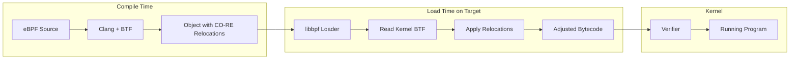
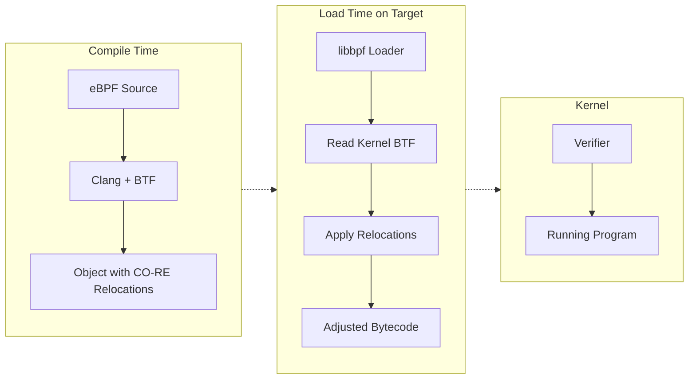
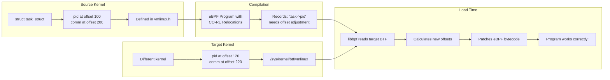

#  `libbpf` and `libbpf-rs`:

- C and Rust way to write eBPF programs
- Use Aya for projects that want to skip `libbpf` but still want CO-RE

---

# libbpf

References:
    1. [Linux kernel libbpf overview](https://docs.kernel.org/bpf/libbpf/libbpf_overview.html)
    2. [Howto use libbpf for CO-RE development](https://oneuptime.com/blog/post/2026-01-07-ebpf-libbpf-portable-development/view)

## Introduction:

Before we start with `libbpf-rs`, a look at `libpf`  and what's under the hood of `libbpf`:

- `libbpf` is Swiss Army Knife for eBPF development, as it sync with the kernel development and
implementation, While `eBPF` allows to run custom code inside Linux kernel, it can only understand raw
bytecode for eBPF VM. 

- `libbpf` is the standard C library that handles this dirty work of taking human readable code and
  getting it safely and effectively into the kernel. 

- what `libbpf` offers:
    - Program loading and verification - Load eBPF bytecode into the kernel.
    - Map management - Create and interact with eBPF maps.
    - Skeleton generation - Auto-generate C headers for easy program interaction.
    - CO-RE support - Enable portable eBPF programs across kernel versions.
    - BTF integration - Leverage type information for portability.

### Loader and Manager:

For the eBPF programs to run in the kernel, it has to go through a complex life-cycle which is divided into
3 steps which is handled by a loader/manager program:
- Opening: 
    - The Bytecode (ELF file) is generated by clang(-target bpf) or LLVM ( --target bpfel-unknown-none)
      is parsed, to find the programs and data structures( maps ) you define in the code. 
    - In modern CO-RE development using tools like `clang` and `libbpf` we generally use `-target bpf` flag
      to invoke the compiler. Which produces relocatable ELF object file containing the BPF bytecode. 

    Reference: [eBPF assembly with LLVM](https://qmonnet.github.io/whirl-offload/2020/04/12/llvm-ebpf-asm/)

- Loading:
    - The loader program interacts with `bpf()` system call to move the bytecode into the kernel and
      triggers the Verifier which ensures the loaded code won't crash the system 

- Attaching: 
    - It hooks your program to the right place: where that's a network interface (XDP) a kernel function
      (kprobe) or a `tracepoint`(tp)...
    - Linking is also done using `bpf()` system call with `BPF_LINK_CREATE` command to establish a
      connection between the loaded eBPF program and the specific kernel hook.

    NOTE: for older kernel `bpf()` call is used with `BPF_PROG_ATTACH`

    - For `kprobes` and `uprobes` the `perf_event_open()` syscall can be used to create a performance event
      file-descriptor which is then used to attach the `eBPF` program. 

    - `setsockopt()`: For socket filter programs, the programs file descriptor can be attached to a socket
      using `setsockopt()` with `SO_ATTACH_BPF` option.


- `bpf()`: this syscall is the central interface for most of the eBPF programs, including loading
  (BPF_PROG_LOAD) and managing its attachment using modern `BPF_LINK_CREATE` commands.

### CO-RE: (Compile Once - Run Everywhere)

This is the most famous feature of `libbpf`. Historically eBPF program were brittle; if you compiled a
program for one kernel version, it often wouldn't work on another because the data structures change.

- `libbpf` uses **BTF** ( BPF Type Format ) to `read` the target kernel at runtime. It then automatically
  adjusts ( relocates ) the program's memory offsets to match that specific kernel. This allows to ship a
  single binary that works across many distributions and version without needing to recompile on each
  machine.

- CO-RE technology that enables truly portable of eBPF programs. Below is the flow:




Or 



### How CO-RE Relocations Work:


On compilation a eBPF program with CO-RE:

- Compiler: The compiler (clang/LLVM) records field offsets from the development machine's kernel headers

- Loading: On loading `libbpf` reads the target kernel's **BTF** and adjusts field offsets to match.

- Result: The same compiled program works across different kernel version.

### Skeleton Generation:

Additional info  Skeleton generation check -> [Details on Skeleton Generation](#SkeletonGeneration)

Skeleton files act as a glue between the kernel eBPF code and the user-space loader code.

First the eBPF programs are compiled to BPF object files ( using clang )

Next we use `bpftool` to strip these compiled object files and wrap it into a C header file. 

These generated skeleton files are used by the loader program, its included in the user-space code as
header.

The generated skeleton header contains:
    - Embedded bytecode: The actual BPF instructions are stored as string within the header, so you dont
      have to strip a separate `.o` file with your binary.
    - Structure Definitions: It automatically creates C structures that match your BPF maps and global
      variables, allowing you to access them by name (e.g., skel->maps.my_map) instead of using lookups.

- `libbpf` works with a tool called `bpftool` to generate a "skeleton" (a C header file). 
- This makes it incredibly easy for your user-space application (the part you interact with) to talk to
  your kernel-space `eBPF` program. 
- It provides a clean, type-safe way to access variables and maps without manual memory mapping.

- Before compiling, you need to generate the `vmlinux.h` header from your kernel's BTF.
  `bpftool` command extracts all kernel type definitions into a single header file:

  `bpftool btf dump file /sys/kernel/btf/vmlinux format c > include/vmlinux.h`

Note:
---
Before skeletons existed, developers manually called `bpf_object__open()` and find map file descriptors by 
string names. It was error-prone and tedious. The skeleton makes the BPF program feel like a native
library, providing type safety and auto-loading capabilities.

---
###  Advance program tricks:

- CO-RE provides several macros for safely reading kernel structures with automatic relocation.
- The following examples demonstrate proper CO-RE usage patterns:

```c 
// src/advanced_core.bpf.c
// Advanced CO-RE examples demonstrating safe kernel structure access

#include "vmlinux.h"
#include <bpf/bpf_helpers.h>
#include <bpf/bpf_core_read.h>

// BPF_CORE_READ - Read a single field with CO-RE relocation
// Syntax: BPF_CORE_READ(source_ptr, field1, field2, ...)
// This follows pointer chains safely

SEC("kprobe/do_sys_openat2")
int trace_openat2(struct pt_regs *ctx)
{
    struct task_struct *task;
    struct mm_struct *mm;
    pid_t pid;
    unsigned long start_brk;

    // Get the current task
    task = (struct task_struct *)bpf_get_current_task();

    // Example 1: Read a simple field
    // BPF_CORE_READ handles kernel version differences automatically
    pid = BPF_CORE_READ(task, pid);

    // Example 2: Read through pointer chain
    // This reads task->mm->start_brk safely, handling NULL pointers
    // Equivalent to: task->mm->start_brk but CO-RE safe
    start_brk = BPF_CORE_READ(task, mm, start_brk);

    // Example 3: Using BPF_CORE_READ_INTO for reading into local variable
    // Useful when you need to read the same field multiple times
    BPF_CORE_READ_INTO(&mm, task, mm);
    if (mm) {
        // Now we can use mm safely
        unsigned long end_data = BPF_CORE_READ(mm, end_data);
        bpf_printk("end_data: %lu\n", end_data);
    }

    // Example 4: Read a string field with CO-RE
    // BPF_CORE_READ_STR_INTO handles string copying safely
    char comm[16];
    BPF_CORE_READ_STR_INTO(&comm, task, comm);

    bpf_printk("pid=%d, comm=%s\n", pid, comm);

    return 0;
}

// Example: Reading nested structures with field existence checks
SEC("tracepoint/sched/sched_process_exec")
int handle_exec(struct trace_event_raw_sched_process_exec *ctx)
{
    struct task_struct *task;
    task = (struct task_struct *)bpf_get_current_task();

    // Check if a field exists in this kernel version
    // bpf_core_field_exists() returns true if the field is present
    if (bpf_core_field_exists(task->loginuid)) {
        // The loginuid field exists in this kernel
        // Safe to read it
        unsigned int loginuid = BPF_CORE_READ(task, loginuid.val);
        bpf_printk("loginuid: %u\n", loginuid);
    }

    // Check struct size for compatibility
    // bpf_core_type_size() returns the size of a type
    if (bpf_core_type_size(struct task_struct) > 1000) {
        bpf_printk("Large task_struct detected\n");
    }

    return 0;
}

char LICENSE[] SEC("license") = "GPL";
```

- CO-RE allows to write code that adapts to different kernel versions
```c 
// src/version_compat.bpf.c
// Demonstrating kernel version compatibility with CO-RE

#include "vmlinux.h"
#include <bpf/bpf_helpers.h>
#include <bpf/bpf_core_read.h>

// Use bpf_core_enum_value() to handle enum changes between versions
// Some enums are renumbered or renamed across kernel versions

SEC("tp_btf/task_newtask")
int handle_new_task(u64 *ctx)
{
    struct task_struct *task = (struct task_struct *)ctx[0];

    // Reading the exit_state field - location varies by kernel version
    // CO-RE automatically adjusts the offset
    int exit_state = BPF_CORE_READ(task, exit_state);

    // For optional fields that may not exist, use conditional access
    // This prevents compile errors on kernels without the field
    #define FIELD_EXISTS_HELPER(type, field) \
        bpf_core_field_exists(((type *)0)->field)

    // Example: reading cgroups v2 fields (not in all kernels)
    // The __builtin_preserve_access_index ensures CO-RE relocation
    if (bpf_core_field_exists(task->cgroups)) {
        void *cgroups = BPF_CORE_READ(task, cgroups);
        if (cgroups) {
            bpf_printk("Task has cgroups pointer\n");
        }
    }

    return 0;
}

// Handling renamed fields across kernel versions
// Use BPF_CORE_READ_BITFIELD for bitfield access
SEC("kprobe/__set_task_comm")
int handle_set_comm(struct pt_regs *ctx)
{
    struct task_struct *task = (struct task_struct *)ctx;

    // Access bitfield flags safely
    // Bitfields require special handling due to varying layouts
    unsigned int flags = BPF_CORE_READ_BITFIELD_PROBED(task, atomic_flags);

    bpf_printk("Task atomic_flags: %u\n", flags);

    return 0;
}

char LICENSE[] SEC("license") = "GPL";

```

- BTF (BPF Type Format) detailed 

- `BTF` is the type information format that enables CO-RE. 
- Understanding BTF helps debug portability issues.

 - The following diagram shows how BTF enables CO-RE relocations:


- Below commands help explore / debug BTF info:
```bash 
# List all types in kernel BTF
bpftool btf dump file /sys/kernel/btf/vmlinux | head -100

# Search for a specific type
bpftool btf dump file /sys/kernel/btf/vmlinux | grep -A 20 "struct task_struct {"

# Dump BTF from a compiled eBPF object file
bpftool btf dump file build/program.bpf.o

# Show BTF in a more readable format (with names)
bpftool btf dump file /sys/kernel/btf/vmlinux format raw | less

# List all available kernel modules with BTF
ls /sys/kernel/btf/

# Check a specific kernel module's BTF
bpftool btf dump file /sys/kernel/btf/nf_tables 2>/dev/null || \
    echo "Module BTF not available"
```

- => *** 
    [More @ libbpf - CO-RE](https://github.com/oneuptime/blog/tree/master/posts/2026-01-07-ebpf-libbpf-portable-development)
  *** <= 


#### Code layout: ( project based on libbpf )

- Template project for can be found at [**libbpf-bootstrap**](https://github.com/libbpf/libbpf-bootstrap)

- [**libbpf** project](https://github.com/libbpf/libbpf)

- [BPF CO-RE Reference Guide](https://nakryiko.com/posts/bpf-core-reference-guide/)

- [BPFTool manual](https://www.mankier.com/8/bpftool)

Create the project directory structure:

```bash 

mkdir -p my-ebpf-project/{src,include,build}

# The final structure should look like this:
# my-ebpf-project/
# ├── Makefile           # Build configuration
# ├── src/
# │   ├── program.bpf.c  # eBPF kernel-space program
# │   └── main.c         # User-space loader program
# ├── include/
# │   └── common.h       # Shared definitions
# └── build/             # Compiled artifacts
#     ├── program.bpf.o  # Compiled eBPF object
#     └── program.skel.h # Generated skeleton header
```

Typical code layout includes:
- A BPF program 
- A Loader program

---

# `libbpf-rs` : 

- `libbpf-rs`: this is official Rust wrapper around C library `libbpf` and this changes the work flow in
  specific way.

- The core concept: ( manage two different environments )
  1. Kernel Side (`.bpf.rs`): This is still compiled to BPF bytecode. It has limited memory access and
     must pass the kernel verifier. 
  2. User-Space (Rust binary): This is standard Rust. It handles the loading logic and UI of the user
     program.

## How Rust handles libbpf concepts:

- In regular C+libbpf we use a complex Makefile. In Rust we use a helper crate called `libbpf-cargo`
  * It acts as a *build script* (`build.rs`)
  * During compilation, it takes the C-style eBPF code ( or Rust-BPF code), compiles it using LLVM and
    generated *Rust "Skeletons" automatically. 
  * This means the eBPF maps and programs appear as native Rust struct's that you can call directly. 

## Safety and Lifetime:

The biggest challenge with `libbpf` in C is memory management—manually opening, loading, and destroying
objects. 
    - *RAII (Resource Acquisition Is Initialization)*: 
       In libbpf-rs, when your Rust Skel object goes out of scope, the library automatically
       detaches the programs and closes the file descriptors. No more leaking BPF links because
       you forgot a close() call.
    - Type Safety: 
      If you define a Map in eBPF, the generated Rust skeleton ensures you are passing the correct
      data types into that map from the user-space side.

## Handling the "Unsafe" Bridge

- `libbpf-rs` is a wrapper around a C library, => it is technically "unsafe" code under the hood, however
  the crate provides a safe abstraction layer.

- with `libbpf-rs` you spend most of the app's time (99%) of time in safe Rust.

- The library handles the pointer arithmetic and FFI (Foreign Function Interface) calls to the underlying 
  `libbpf` C code so you don't have to.


## `libbpf-rs` Workflow:

- Define: You write eBPF programs (often in C, though projects like aya allow pure Rust in the kernel,
  `libbpf-rs` usually assumes the kernel side is compiled from C or specialized Rust).

- Gen: `libbpf-cargo` generates a Rust "Skeleton" at compile time.

- Load: In your main.rs, you call `ObjectBuilder` to load the bytecode.

- Attach: You attach to the hook (e.g., `.attach()`).

- Consume: You use `RingBuffers` or `PerfBuffers` to stream data from the kernel back to Rust. `libbpf-rs`
  provides excellent asynchronous support for this, fitting perfectly into the tokio or async-std ecosystems.

## Additional Details:

- [**libbpf-rs** doc](../progs/libbpf-rs/Readme.md)

--------------------------

# SkeletonGeneration 

When working with libbpf we have C BPF program in kernel and C loader/manage program in the user space since
these two are in different worlds and they need to agree to some mem layout and map names. 

A **Skeleton** acts as a glue that makes this interaction smooth and type-safe. 

## History: 2015-2017 
During this early phase developer mostly used **BCC** :
1. *Work Flow* : You wrote BPF code as a string inside Python or C++ string. BCC compiled it on the fly
   using the kernel headers installed on the specific machine. 

2. *tools*: There was no use of tools like `bpftool` or `pahole` because "skeleton" concept didn't exit
   yet. Developers used BCC library to load the code. 

### Transition `pahole` ( BTF Pioneer ):
Community moved towards `libbpf` and `CO-RE` which demanded a way to describe kernel data struct's
compactly. `pahole` ( Poke-a-Hole ) became essential. 
- `pahole`: was originally a tool to find "holes" (wasted spaces) in C structs to optimize memory. 
- BPF Connection: Around 2017-2018 `pahole` was updated with the ability to take massive, bulky *DWARF*
  debug information from the kernel and compress it into BTF (BPF Type Format)
---
Note: `DWARF` ( Its like a complete encyclopedia of a program )
- It's the standardized *debugging data format* used by compiler (`clang` and `GCC`)to describe how a
  compiled binary maps back to the original source code. 
- When we compile a C/C++ code most of the high level info is lost:
    - Variable names 
    - Types and structs 
    - Source file + line numbers. 
- `DWARF` stores all that extra metadata so tools line debugger can reconstruct the program. 

- `DWARF`: its not executable code, rather its *structured metadata embedded in the binaries ( generally in
  the ELF section like `.debug_info`), Which includes:
  - Type info : structs, unions, enums, **Field offsets and sized*
  - Example: how a `struct task_struct` is laid out in memory. 
  - Variable & symbol info: variable names, scopes (local/global) , memory location 
  - Source location: Which instruction points to which line number in a file of source code. 
  - Function metadata: func names, parameters, in-lining info 

- This additional meta data info makes DWARF bulky, for kernel it can run into hundreds of MB) and its
  complex tree-like struct with tons of cross references, and unoptimized for runtime use. 

- `pahole`: updated for extracting the BTF ( DWARF -> BTF conversion was required ). So 
    - `pahole`: updated to extract the type information 
    - convert it into BTF format. 
    - This reduces the size , Simpler structures, Designed for kernel+eBPF runtime use.
--- 

- Kernel Compilation: kernel build runs a process `pahole -J` , it purpose is to embed BTF information into
  the kernel binary itself. Which is key for `bpftool` or `pahole` to work with.

- `bpftool`: Introduced as of 2017 to work with BPF introspection, and more. And as of 2019 `gen skeleton`
  command was extended to solve the "glue code" problem.
  - It takes BTF information ( that `pahole` helped create) and the compiled BPF object file to generate
    that high-level C header ( The skeleton )
  -  `bpf Object byte code` + `BTF info generated by pahole /sys/kernel/btf/vmlinux` 
  - for modules `bpf Object byte code` + `BTF info generated by pahole /sys/kernel/btf/<module_name>` 
    ```bash 
    # To get core types + module types in one header
    bpftool btf dump file /sys/kernel/btf/vmlinux format c > vmlinux.h
    bpftool btf dump file /sys/kernel/btf/your_module format c >> vmlinux.h
    ```

## Purpose: 
Early development of eBPF, you had to manually find the map *file descriptor*, loop up the program names by
String, and carefully manage the loading process. ( BCC hides this complexity from developers by using
python/lua wrappers with a additional cost of requiring Clang/LLVM on every production/deployed server ).

Understanding **Skeleton**: 
---
- Manual Process ( `sample/bpf` )
  For writing high performant BPF applications ( BCC is heavy ) developers used "C" based loader programs:
  1. Required Manual Bytecode loading: As there is no skeleton, Developer has to manually tell the kernel to
     open the compiled bytecode ELF file (`.o` file), parse the sections, and load them. 
     ```C 
     // Early days: You had to use low-level helpers to find the file
     struct bpf_object *obj = bpf_object__open("my_prog.o");
     bpf_object__load(obj);
     ```
  2. String-to-FD : As there was no Skeleton, the loader program ( C code) has no idea where the maps or
     programs where in memory. And required to look them up by their **string names**, which was a cause of
     typos and runtime crashes. 
     ```c
     // Getting a file descriptor (FD) for a map
     int map_fd = bpf_object__find_map_fd_by_name(obj, "my_config_map");
     if (map_fd < 0) {
        // Handle error: oops, did I name it "my_config_map" or "config_map"?
     }
     // Getting a program handle to attach it
     struct bpf_program *prog = bpf_object__find_program_by_name(obj, "bpf_prog_main");
     ```
  3. Manual Map Updates for Configuration:  If you want to pass a configuration value ( ex: port number,
     ip_addr.. ) the BPF program, you coundn't just change a variable, You had to:
     1. Create a `BPF_MAP_TYPE_ARRAY` in your BPF code .
     2. In User-space loader find the FD for that map.
     3. call `bpf_map_update_elem(map_fd, &key, &value, BPF_ANY )`
     4. Inside the BPF kernel code, call `bpf_map_lookup_elem()` every time you need that value. 

This process is slow and required lots of boilerplate code that has nothing to do with the actual logic.
And BCC used python front-end to do the string lookup for you. 
```python 
# BCC magic : it looks up 'my_map' in the compiled C string automatically:
b["my_map"][0] = ct.c_int(80)
```

BCC compiles the code at runtime. To find those maps, it literally invokes a compiler, parses your C code, 
and generates the mapping on the fly. This is why BCC programs take seconds to start and eat up hundreds of 
megabytes of RAM just to "load."

- Why the Skeleton is the "Goldilocks" Solution: It gives you the performance of the old C loaders with the
  ease of use of BCC, but adds Compile-time Safety.

|Step |Early C Loader|BCC (Python)|Modern Skeleton (Libbpf)|
| --- | --- | --- | --- |
|Mapping|"find_map_by_name(""name"")"| Auto-parsed at runtime|skel->maps.name (Autocompleted) |
|Config|Manual map updates|Map updates via Python|skel->bss->var = 10 (Direct memory)|
|Binary|.o file + .c loader|Source code string|Single integrated binary|
|Safety|High risk of runtime crash|"Easy, but slow"|Type-safe and verified at compile time|

- **"Global Variable"** Earlier every had to be a map. A big shift was a move from Maps to Global Variables
  ( via the `.bss` and `.data` sections ). With Skeleton `bpftool` sees your `static int my_config;` in the
  BPF code and creates a pointer in the Skeleton header. When user-space program writes to that pointer, it
  writes directly into the BPF programs memory. No `lookup_elem` required. 

### Summary of Manual process ( post CO-RE )

- BPF programs were hard-coded map of the kernel it was compiled on. 

- To understand how the manual process worked and how it contrasts with the BTF-powered CO-RE process,
- Manual Process (Pre-CO-RE): If BPF code accessed a kernel struct, `task_struct->pid`, the compiler(Clang)
   would calculate the exact byte offset of `pid` based on the kernel headers on your development machine.
   * **Compilation**: `Clang` sees `pid` at offset `1200`. It hard-codes `1200` into the BPF bytecode.
   * **Loading**: user-space loader (your manual C code) would push that bytecode into the kernel.
   * **The Hook**: You would find the *tracepoint* or *kprobe* by string, get an FD, and manually call
     `bpf_prog_attach`.
   * **Error**: Running same binary on a different kernel version where a new field was added to 
     `task_struct`, `pid` might now be at offset `1208`. Your BPF program would still look at `1200`, read 
     garbage data, and likely be rejected by the verifier or report wrong values.

 
 ## CO-RE: Using BTF & Hooks

Modern skeleton and `libbpf`, use `BTF` Relocation to fix this "offset drift" at the moment the program is 
loaded.

- Step 1: Recording the Intent (Compile Time)
  - Instead of just hard-coding `1200`, Clang records a Relocation Record in the `.BTF.ext` section of your 
  `.o` file. It basically writes a note: "This instruction wants to access the field 'pid' inside 
  'struct task_struct'."

- Step 2: Handshake (Load Time)
  - When your skeleton calls load(), `libbpf` performs a three-way comparison:
    1. **Source BTF**: The types recorded in your `.o` file (the "Intent").
    2. **Target BTF**: The actual `/sys/kernel/btf/vmlinux` (the "Reality" of the running kernel).
    3. **The Bytecode**: The actual instructions.

- Step 3: Atomic offsetting: If the running kernel says `pid` is at offset `1208`, but your bytecode was 
  compiled for `1200`, `libbpf` rewrites the bytecode on the fly before it hits the verifier. It changes the
  instruction to use `1208`.

**How the "Hook" connects**:

The skeleton also automates the *Attach* phase using `BTF-id` lookups. 
- In Manual: You had to look up /sys/kernel/debug/tracing/events/... to find a hook ID.
- In Modern: 
  - Because the kernel is "self-describing" via BTF, the skeleton knows exactly which function signature the
    hook expects.
  - When you call `skel->attach()`, `libbpf` looks up the `BTF ID` of the kernel func (eg: tcp_v4_connect) 
    and tells the kernel: "Attach this BPF program to the function with `BTF ID 4502`."


## Rust `libbpf-rs`: 

We will see the same pattern in Rust ecosystem because `libbpf-rs` is built on top of "C" `libbpf` library. 

In Rust Skeleton is generated by build script ( `build.rs` ) using crates like `libbpf-cargo`. 

`libbpf-cargo`: performs the same role but adapts it to **Rust's safety and idiomatic patterns**:
- **Memory Safety**:  Wraps the raw C pointers from `libbpf` into safe Rust structs .
- **Resource cleanup**: It Implements a `Drop` Trait, when your skeleton object goes out of scope in Rust,
  it automatically detaches and unloads the BPF prom from kernel. 
- **Data Synchronization**: Just like "C" `.bss` section, Rust skeleton provides a `struct` that maps to the
  BPF global variables, allowing you to pass configurations to the kernel using native Rust types. 

Essentially, the skeleton turns a complex kernel-subsystem interaction into a standard object-oriented 
programming task.


## Aya : Full Rust way:

- Fundamentally different from `libbpf` because it is a **pure-Rust implementation** of the eBPF loader and 
  relocation engine. 

- It doesn't wrap the C `libbpf` library; it recreates that logic from scratch using the `bpf()` system call
  directly.

- As it doesn't use `libbpf`, => no need for `bpftool gen skeleton` workflow. Instead, it achieves the same 
  "easy glue" effect through **Rust's Type System** and **Proc-macros**.

### 1. How Aya Replaces the Skeleton

- In `libbpf`,skeleton is a generated C header that embeds the bytecode. 
- In Aya, no generation of skeleton file is required. Instead, you use the `include_bytes_aligned!` macro 
  to pull the compiled eBPF bytecode directly into your Rust binary.

### The Aya Workflow:
1. **Compilation:** You compile your eBPF Rust code (using `bpf-linker`) into an ELF object file.
2. **Embedding:** In your user-space Rust code, you embed that file:
   ```rust
   let mut bpf = Ebpf::load(include_bytes_aligned!("../../target/bpfel-unknown-none/release/my-prog"))?;
   ```
3. **Implicit Mapping:** Aya parses the ELF file at **runtime** (when the app starts). It looks at the ELF sections to find maps and programs. You then "grab" them by name:
   ```rust
   let program: &mut Xdp = bpf.program_mut("my_xdp_prog").unwrap().try_into()?;
   program.load()?;
   program.attach(&interface)?;
   ```


---

## 2. How it achieves CO-RE (Automatic Offsetting)
This is the most impressive part of Aya. Since it doesn't use `libbpf`, Aya has its own internal **Relocation Engine** written in Rust.

* **Parsing BTF:** When you call `Ebpf::load()`, Aya reads the `/sys/kernel/btf/vmlinux` file on the host machine and parses it into a Rust-native BTF representation.
* **Comparing Types:** It then looks at the BTF info embedded in your compiled `.o` file.
* **Instruction Rewriting:** Just like `libbpf`, Aya finds the instructions that need relocating (like a field access to `task_struct->pid`) and **rewrites the bytecode in memory** to the correct offset before it sends that bytecode to the kernel via the `bpf()` syscall.

---

## 3. Sharing Types (The "aya-tool" helper)
One of the main benefits of the `libbpf` skeleton is sharing `struct` definitions between the kernel and user space. Aya handles this using two main methods:

### Method A: Shared Rust Crate
Since both your kernel code and user-space code are in Rust, you can put your shared data structures in a separate crate:
```rust
// In shared/src/lib.rs
#[derive(Copy, Clone)]
#[repr(C)]
pub struct PacketLog {
    pub ipv4_address: u32,
    pub action: u32,
}
```
Both your eBPF program and your user-space app import this crate. **No C header generation required.**

### Method B: `aya-tool` (for Kernel Structures)
If you need to access complex kernel structures (like `task_struct`), you use a tool called `aya-tool`. It acts like `bpftool` but instead of generating a C skeleton, it uses `bindgen` to generate **Rust bindings** for those kernel types.

---

## 4. Why Aya uses the `bpf()` Syscall Directly
By avoiding `libbpf`, Aya gains a few "Rust-native" superpowers:
* **No C Toolchain:** You don't need `clang` or `libelf` installed on your target machine. A single statically linked Rust binary is all you need.
* **Async Support:** Because Aya controls the file descriptors for the BPF maps and programs directly, it can integrate them with the `Tokio` or `async-std` runtimes. You can `await` on a BPF Ring Buffer, which is nearly impossible with a standard `libbpf` wrapper.

### Summary Comparison

| Feature | `libbpf-rs` (Skeleton) | Aya (Pure Rust) |
| :--- | :--- | :--- |
| **Generation** | `bpftool` creates a C header. | No skeleton file; Rust macros embed bytecode. |
| **Relocation** | Handled by C `libbpf` logic. | Handled by Aya’s built-in Rust relocation engine. |
| **Type Sharing** | C headers translated to Rust. | Shared Rust crates or `aya-tool` bindings. |
| **Dependencies** | Requires `libbpf` (often dynamically linked). | Zero-dependency (only `libc`). |

Aya essentially proves that you don't *need* a skeleton file if your language is powerful enough to parse
ELF files and BTF info at runtime! 

ToDo: How Aya handles CO-RE.
